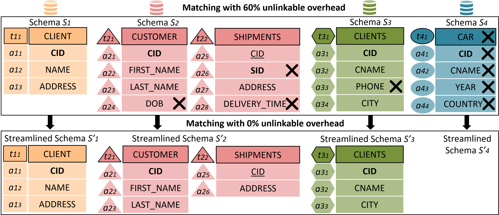
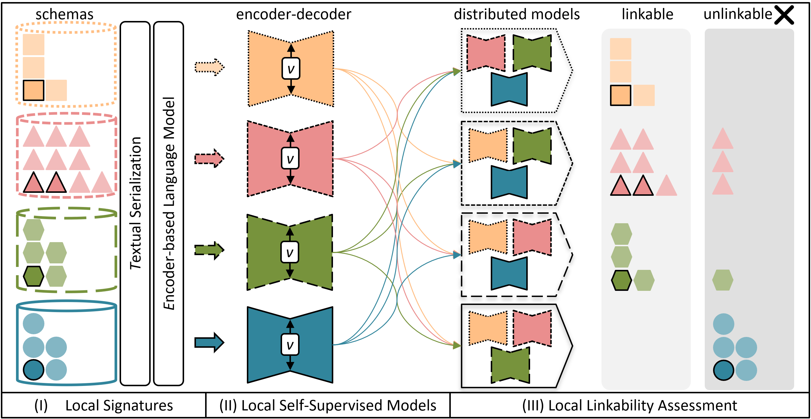

# Scoping Streamlined Schemas
_Motivating Introduction_: Given a set of multi-source schemas, we aim to identify the streamlined subset of these, which includes only linkable tables and attributes needed for a complete schema integration view. Identifying the set of streamlined schemas is an approximation.

# Collaborative Scoping: Self-Supervised Linkability Assessment for Schema Matching

_Method Description_: Collaborative Scoping is a robust and self-supervised approach to locally examine the linkability of schema elements and prune unlinkable ones ahead on their way toward matching multiple heterogeneous schemas with different volumes, designs, and domains. The overall framework entails the three phases: (I) Local Signatures, (II) Local Self-Supervised Model, and (III) Local Linkability Assessment with Distributed Models. 

## Datasets
The datasets contain the two differently challenging multi-source schema matching scenarios OC3 and OC3-FO. Both datasets store the tables and attributes of all schemas as records with their extracted metadata (id, type, parent_id, schema, name, parent_name, datatype, constraints), its serialization (text_sequence), and annotated linkable (true) and unlinkable (false) label (label_linkability). 

**OC3** contains three schemas on Orders-Customers from the three database vendors:
- Oracle: https://github.com/oracle-samples/db-sample-schemas
- MySQL: https://www.mysqltutorial.org/mysql-sample-database.aspx
- SAP HANA: https://developers.sap.com/tutorials/hxe-ua-dbfundamentals-sample-project.html

**OC3-FO** extends OC3 with a domain-unrelated schema on Formula One, sourced from the
- jolpica-f1 project: https://github.com/jolpica/jolpica-f1

**Linkages** that were annotated between the OC3 schemas.

**Scoping Evaluation** of the AUC-F1, AUC-ROC, AUC-ROC', and AUC-PR performance in raw and analyzed on the difference between Scoping and Collaborative Scoping on OC3 and OC3-FO.

**Matching Ablation Study** of Pair Quality (PQ), Pair Completness (PC), F1, and Reduction Ratio (RR) for Matching (SIM) and Blocking (k-Means and LSH) with Collaborative Scoping on OC3 and OC3-FO.

See `./data` for more details.

## Quick Start

Open the collaborative_scoping.ipynb file in a Jypter Notebook with Python >= 3.12.5. The script is structured and executable step-by-step in the following order of sections:
1. Libraries (Requirements: Pandas, NumPy, Matplotlib, Seaborn, Plotly, Tensorflow, Keras, Sklearn, and Scipy)
2. Datasets
3. Signatures
4. Utilities for Scoping (ODA, Helper Functions, Performance Metrics, #PCA given Explained Variance)
5. Scoping (Z-Score, LOF, PCA, Autoencoder)
6. Collaborative Scoping (PCA)
7. Evaluation (Table, Plots)
8. Evaluation of Matching and Blocking (Plots)

For any questions, please feel free to send me a message at <leonard.traeger@umbc.edu>.

